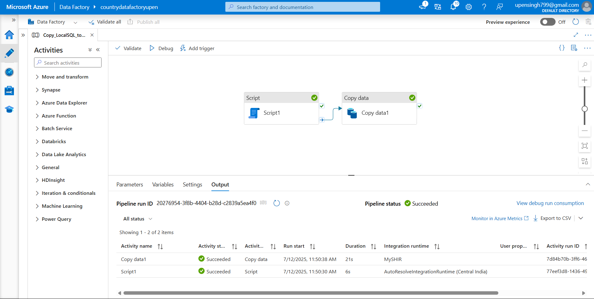
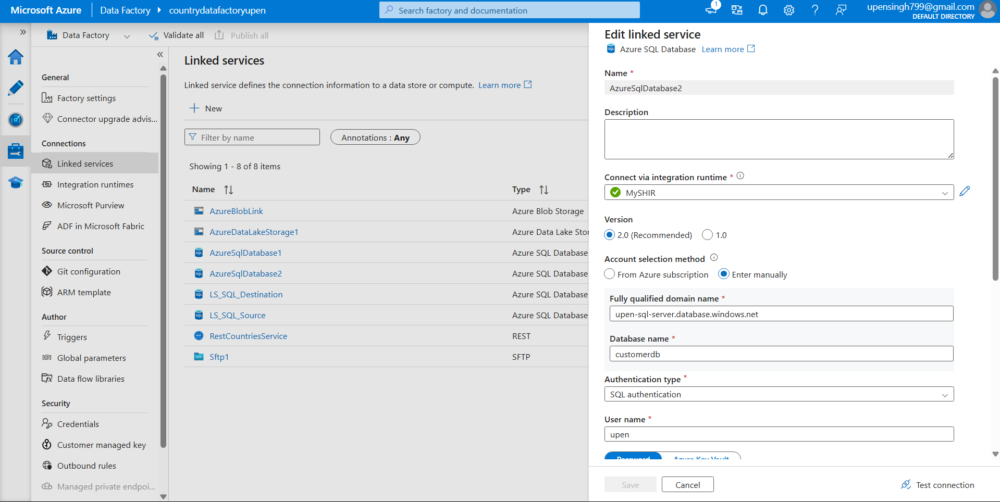
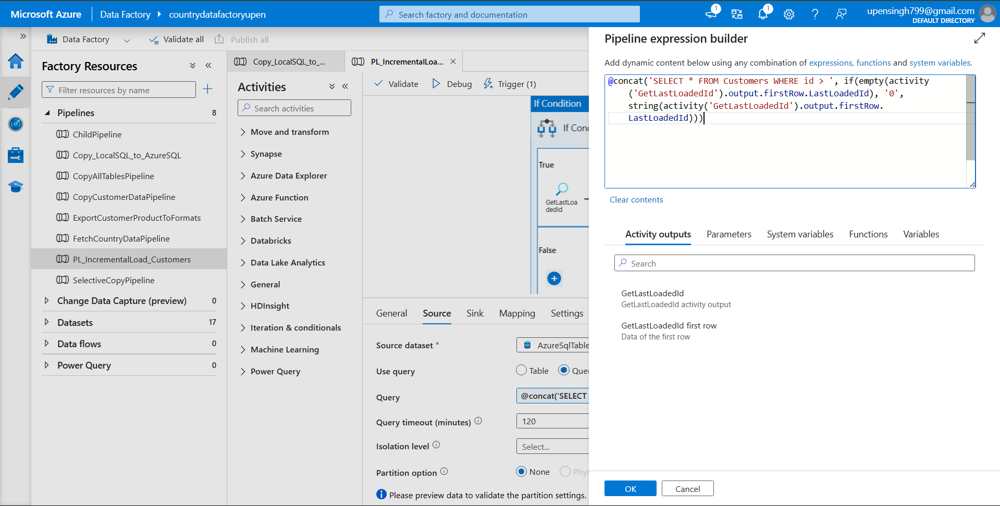
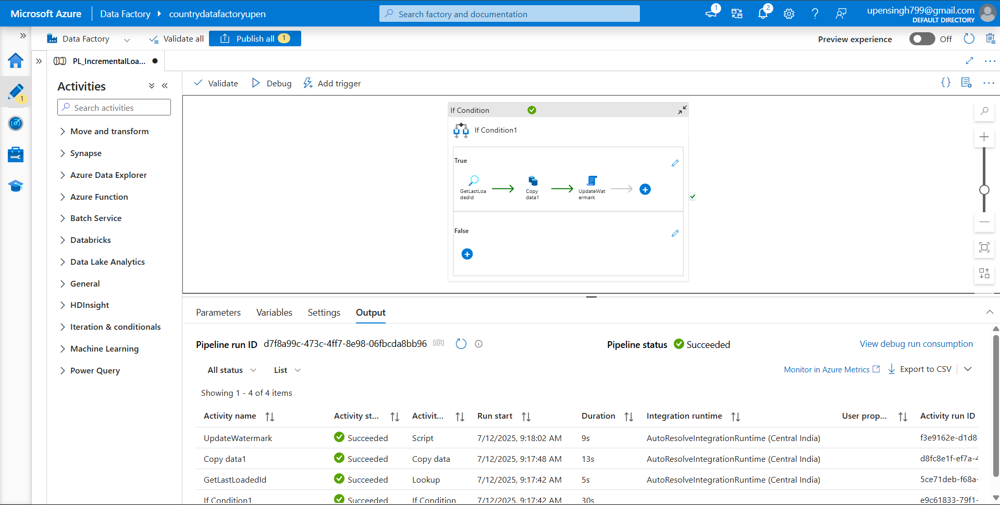
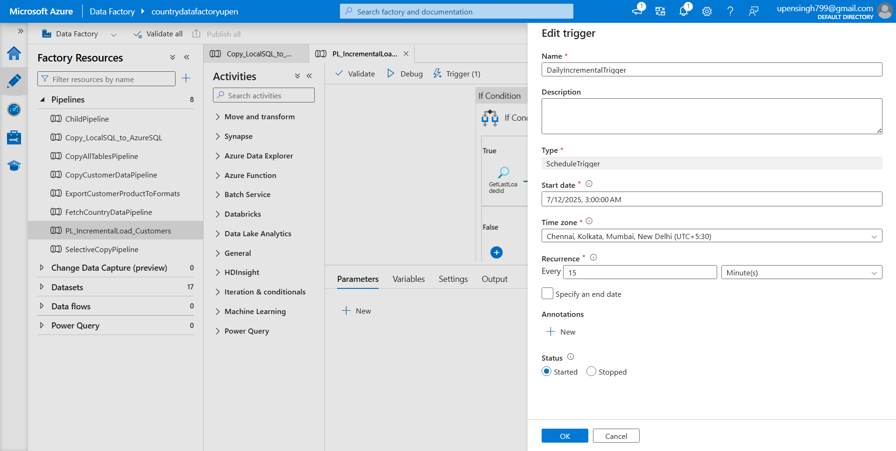
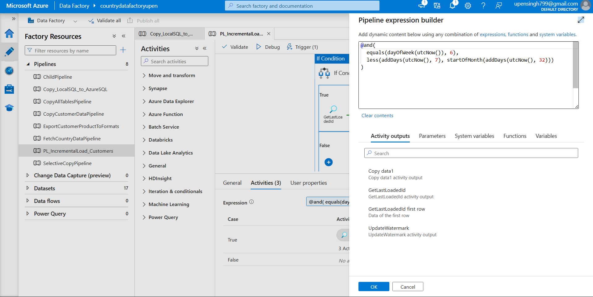
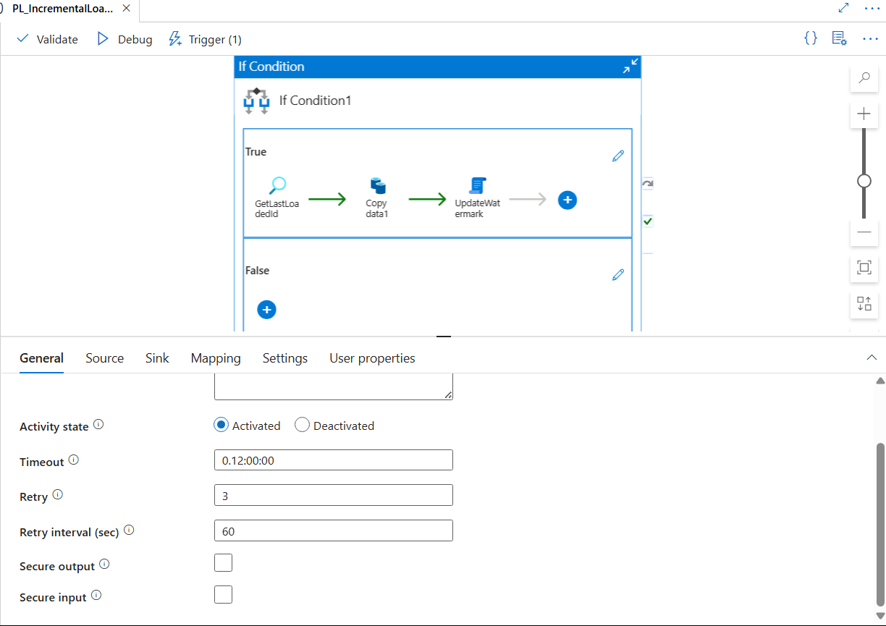

# Week 6 Advance ADF

## 🔖 Tech Highlights


This repository contains various advanced Azure Data Factory (ADF) pipelines demonstrating real-world integration use cases, automation, and data engineering best practices.

---

## 📌 Completed Tasks

---

## ✅ Task 1: Load Data from Local SQL Server to Azure SQL using SHIR

🔹 Uses Self-hosted Integration Runtime to securely connect on-prem to Azure  
🔹 Copy data from local SQL to Azure SQL table

### 🔧 Pipeline JSON:
[View Detailed Documentation](Advance_ADF/All_Pipeline_View/Local_To_AzureSQL.json)

### 🖼️ Screenshots:

### Pipeline View :
- 

---

### SHIR Setup :
- 

---

## ✅ Task 2: Incremental Load Pipeline (with Watermark Logic)

🔹 Incrementally loads only new records from the `Customers` table using `id` as watermark  
🔹 Retrieves last loaded ID from watermark table  
🔹 Uses dynamic SQL with parameterized query

### 🔧 Pipeline JSON:
[View Detailed Documentation](Advance_ADF/All_Pipeline_View/Incremental_Load_Pipeline.json)

### 🖼️ Screenshots:

### Watermark Variable :
- 

---

### Pipeline View: 
- 

---

### 🧠 Watermark Logic (Dynamic SQL Query)

```json
{
  "sqlReaderQuery": {
    "value": "@concat('SELECT * FROM Customers WHERE id > ', if(empty(activity('GetLastLoadedId').output.firstRow.LastLoadedId), '0', string(activity('GetLastLoadedId').output.firstRow.LastLoadedId)))",
    "type": "Expression"
  }
}
```

---

## ✅ Task 3: Automate Daily Runs with Trigger

🔹 Pipeline is triggered **daily**  
🔹 Internally uses `IfCondition` activity to run **only on the last Saturday of the month**

### 🔧 Trigger:
- Configured in the ADF GUI as daily schedule

### 🖼️ Screenshots:

### Incremental Daily Trigger:
- 

---

### Last Saturday Trigger :

- 
---

### 🧠 Last Saturday Execution Logic

```json
{
  "expression": {
    "value": "@and(\n  equals(dayOfWeek(utcNow()), 6),\n  less(addDays(utcNow(), 7), startOfMonth(addDays(utcNow(), 32)))\n)",
    "type": "Expression"
  }
}
```

---

## ✅ Task 4: Retry Logic for Fault Tolerance

🔹 The `Copy` activity is configured with retry policy:
  - Retries: 3
  - Retry Interval: 60 seconds  
🔹 Helps auto-recover from transient failures

### 🖼️ Screenshots:

### Retry Logic:

- 

### 🔁 Retry Policy Configuration

```json
{
  "policy": {
    "timeout": "0.12:00:00",
    "retry": 3,
    "retryIntervalInSeconds": 60,
    "secureOutput": false,
    "secureInput": false
  }
}
```

---

## 🔁 Common Dataset/Linked Services

- Azure SQL Dataset (source & destination)
- Watermark Table: `WatermarkTracking` (columns: `TableName`, `LastLoadedId`)

---

## 📌 Notes

- This project assumes `id` is an auto-incrementing primary key.
- All screenshots are proof of correct configuration and successful runs.
- Triggers and SHIR were configured in the ADF authoring UI and runtime environment.

---

## ❌ Skipped Task (SFTP Extraction)

Due to environment limitations, the SFTP pipeline was skipped.

---

## 📅 Author

**Upen Singh**  
M.Tech Aspirant | Data Engineering Enthusiast | Jaipur, India
