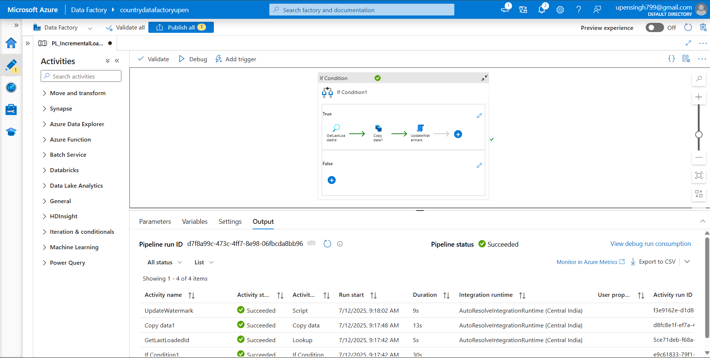

# Week 6 Advance ADF 

This repository contains various advanced Azure Data Factory (ADF) pipelines demonstrating real-world integration use cases, automation, and data engineering best practices.

## 📌 Completed Tasks

---

## ✅ Task 1: Load Data from Local SQL Server to Azure SQL using SHIR

🔹 Uses Self-hosted Integration Runtime to securely connect on-prem to Azure  
🔹 Copy data from local SQL to Azure SQL table

### 🔧 Pipeline JSON:
- `Local_To_AzureSQLjson/`

### 🖼️ Screenshots:
- 

---

## ✅ Task 2: Incremental Load Pipeline (with Watermark Logic)

🔹 Incrementally loads only new records from the `Customers` table using `id` as watermark  
🔹 Retrieves last loaded ID from watermark table  
🔹 Uses dynamic SQL with parameterized query

### 🔧 Pipeline JSON:
- `Incremental Load Pipelinejson/`

### 🖼️ Screenshots:
- 
- 

---

## ✅ Task 3: Automate Daily Runs with Trigger

🔹 Pipeline is triggered **daily**  
🔹 Internally uses `IfCondition` activity to run **only on the last Saturday of the month**

### 🔧 Trigger:
- Configured in the ADF GUI as daily schedule

### 🖼️ Screenshots:
- 
- 

---

## ✅ Task 4: Retry Logic for Fault Tolerance

🔹 The `Copy` activity is configured with retry policy:
  - Retries: 3
  - Retry Interval: 60 seconds  
🔹 Helps auto-recover from transient failures

### 🖼️ Screenshots:
- 

---

## 🔁 Common Dataset/Linked Services

- Azure SQL Dataset (source & destination)
- Watermark Table: `WatermarkTracking` (columns: `TableName`, `LastLoadedId`)

---

## 📌 Notes

- This project assumes `id` is an auto-incrementing primary key.
- All screenshots are proof of correct configuration and successful runs.
- Triggers and SHIR were configured in the ADF authoring UI and runtime environment.

---

## 👤 Author

**Upen Singh**  
Data Engineering Intern @ Celebal Tech  
GitHub: [@upen122](https://github.com/upen122)

---

## ❌ Skipped Task (SFTP Extraction)
Due to environment limitations, the SFTP pipeline was skipped.

---

## 🧠 How to Use
- Navigate to each folder for JSON pipeline exports, screenshots, and step-by-step setup guide.
- Import pipelines into ADF using the "Manage hub" → "ARM Template" if required.

## 📷 Sample Screenshots
> See `screenshots/` folders in each task for detailed configuration and run output.

## 📅 Author
**Upen Singh**  
M.Tech Aspirant | Data Engineering Enthusiast | Jaipur, India
